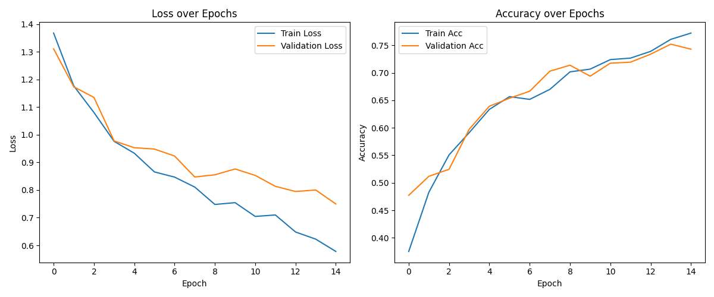
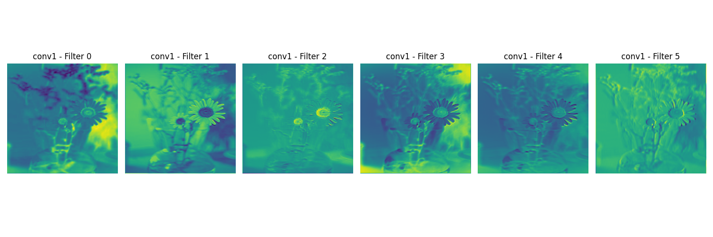
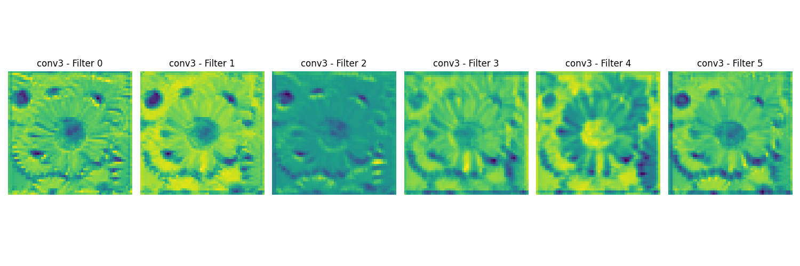
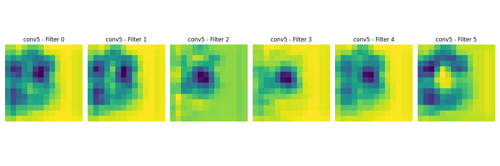
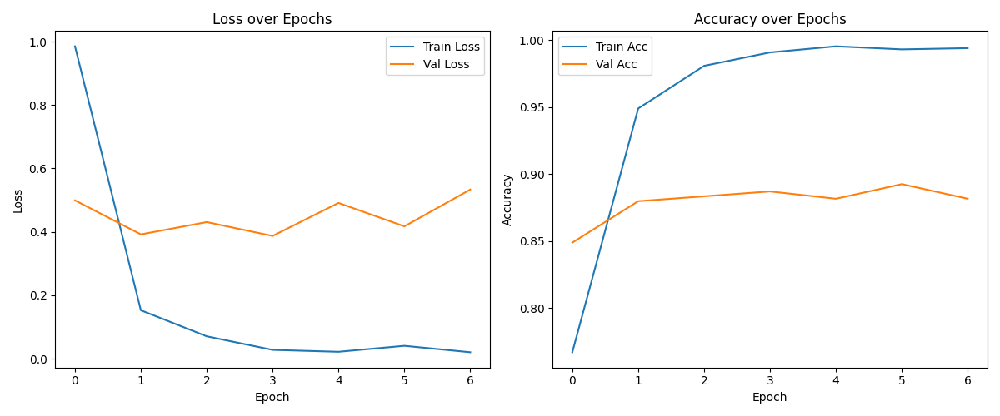
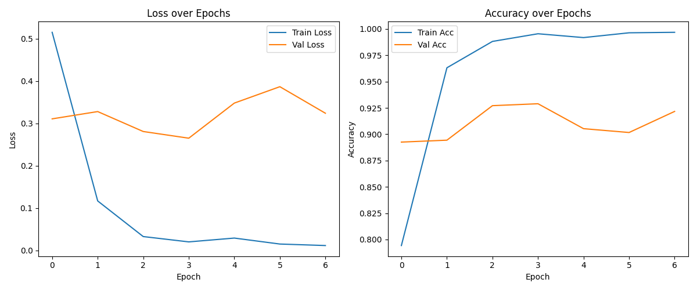
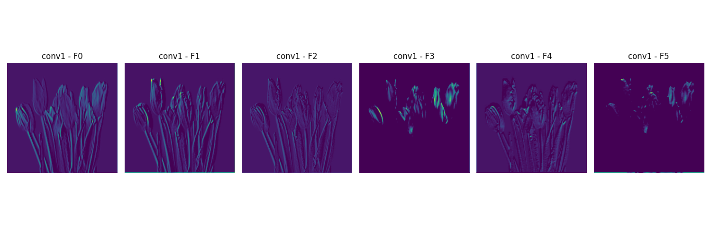
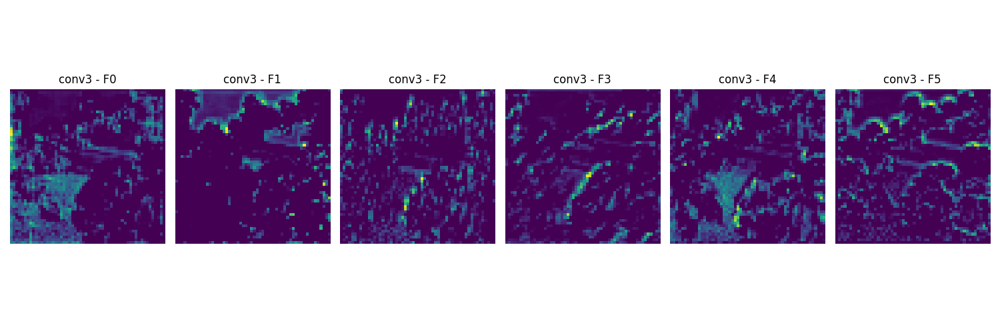
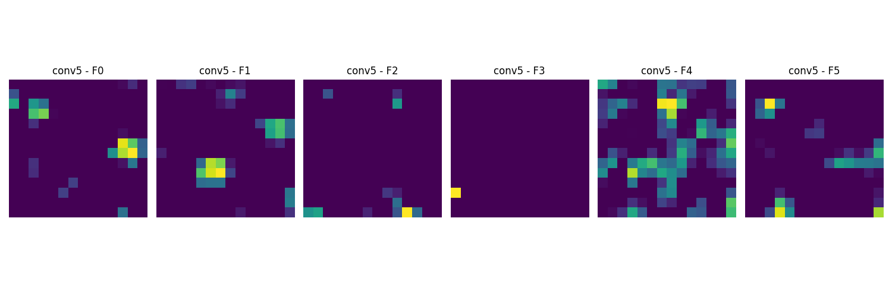

# 🌸 Flower Classification with CNNs and Transfer Learning

> **Course:** SE3508 - Introduction to Artificial Intelligence 🎓  
> **Instructor:** Dr. Selim Yılmaz 👨‍🏫  
> **Student ID:** `230717728` 🧑‍💻

---

## 📋 Project Structure

```
flower_classification_project/
├── trained_models/                       # Trained model weights
├── data/                                # Flower dataset (not uploaded)
│   └── flowers/
├── models/                              # All model architectures
│   ├── CustomCNN.py
│   ├── vgg16_feature_extractor.py
│   └── vgg16_fine_tuned.py
├── training/                            # Training scripts
│   ├── train_custom_cnn.py
│   ├── train_vgg16_feature_extractor.py
│   └── train_vgg16_fine_tuned.py
├── utils/                               # Dataset loader
│   └── dataset.py
├── visualization/                       # Visualization scripts
│   ├── visualize_features.py
│   └── visualize_finetuned.py
├── results/                             # Reports, plots, visual outputs
│   ├── custom_cnn/
│   ├── vgg16_feature_extractor/
│   └── vgg16_fine_tuned/
├── README.md
└── requirements.txt
```

---

## 🌝 Objective
This project explores multi-class flower image classification using modern deep learning approaches. The goal was to build and compare:
- 🌱 A **Custom CNN** model trained from scratch
- 🔍 A **VGG16-based feature extractor**
- 🧠 A **VGG16-based fine-tuned model**

All code was designed to be:
- ✅ Well-documented and readable
- 🔁 Modular and reusable
- 🧩 Compatible with future expansion or experimentation

Additionally, the project integrates concepts such as:
- 📊 Data augmentation
- 🔁 Transfer learning
- 🧠 Feature visualization (Zeiler & Fergus strategy)

---

## 🖼️ Dataset
- 📦 **Source:** [Flowers Dataset on Kaggle](https://www.kaggle.com/datasets/imsparsh/flowers-dataset/data)
- 🌼 **Classes:** Daisy, Dandelion, Rose, Sunflower, Tulip
- 🖼️ **Format:** RGB images of varying resolutions

All images were:
- Resized to **224x224**
- Normalized with ImageNet statistics
- Augmented using:
  - 🔄 Random horizontal flip
  - 🌀 Random rotation

---

## 🫠 Model 1: Custom CNN

### 🧪 How This Model Was Created
This custom CNN was built from scratch to give full control over architecture design. It includes five convolutional blocks with ReLU activations and max pooling. A dropout layer was added before the final fully connected layer to help regularize the model and reduce overfitting.

### 🧠 Model Architecture
The CustomCNN is a deep CNN built with 5 convolutional layers followed by ReLU, MaxPooling, and 2 fully connected layers.

### 🧱 Layer-by-layer Design
```
Conv1: 3 → 16 filters
Conv2: 16 → 32
Conv3: 32 → 64
Conv4: 64 → 128
Conv5: 128 → 256
```
All conv layers are followed by:
- 🔹 ReLU Activation
- 🔹 2×2 MaxPooling

At the end:
- 🔸 Flatten + FC(512) + FC(5)

### ⚙️ Training Procedure
| 🔧 Parameter     | 🔢 Value        |
|------------------|-----------------|
| Loss Function     | CrossEntropyLoss |
| Optimizer         | Adam             |
| Dropout           | 0.5              |
| Epochs            | 15               |
| Batch Size        | 32               |
| Learning Rate     | 0.001            |

### 🔢 Metrics Performance Report
| Accuracy | Precision | Recall | F1-Score |
|----------|-----------|--------|----------|
| 0.7432   | 0.7555    | 0.7296 | 0.7360   |

-📄 See `classification_report.txt` in `results/` folder for details.

-🔍 Training Insights:
The Custom CNN showed steady learning over 15 epochs, with training and validation accuracy improving in parallel — a good sign of balanced learning. Final validation accuracy reached ~74%, with no clear signs of overfitting. Performance across classes was varied, indicating that deeper architecture or enhanced data augmentation might help further improve generalization.

### 📈 Training & Validation Plots

## 🔬 Feature Visualizations from Custom CNN(Zeiler & Fergus strategy)

### 🧱 **conv1 – First Convolutional Layer**


🟢 The first convolutional layer detects **basic low-level features** such as:  
- 🌈 Color contrasts  
- 📐 Edges  
- 🌫️ Soft gradients  

These filters activate on general visual patterns like object outlines and background textures. They help the network build an initial understanding of the image structure.

---

### 🌀 **conv3 – Middle Convolutional Layer**


🟡 By the third convolutional layer, the model focuses on **mid-level features**, including:  
- 🌸 Petal arrangements  
- 🎯 Flower centers  
- 🧵 Repeated textures  

Filters show more refined responses, concentrating on meaningful structures within the flower. This indicates the model is beginning to recognize flower-specific patterns.

---

### 🧠 **conv5 – Deepest Convolutional Layer**


🔵 The deepest layer captures **high-level, abstract features** such as:  
- 🔬 Class-specific zones  
- 🧠 Semantic details  
- 🔍 Critical regions of interest  

These filters strongly activate on localized, discriminative areas like the flower core. The receptive fields are small, and the output is spatially compressed — indicating that the model has learned where to "look" for classification.


## 🫠 Model 2: VGG16 (Feature Extractor)

### 🧪 How This Model Was Created
The VGG16 model was loaded with pretrained ImageNet weights and used as a frozen feature extractor. All convolutional layers were locked (not trainable), and only the final classifier layers were replaced and trained. This is a classic example of **transfer learning**.

### 🧠 Model Architecture
Pretrained VGG16 was adapted for flower classification with a custom classifier head.

### 🧱 Layer-by-layer Design
```
🔒 VGG16 feature layers (frozen)
🔄 Replace classifier:
  → FC(4096) → ReLU → Dropout
  → FC(1024) → ReLU → Dropout
  → FC(5) (output layer)
```

### ⚙️ Training Procedure
| 🔧 Parameter     | 🔢 Value        |
|------------------|-----------------|
| Loss Function     | CrossEntropyLoss |
| Optimizer         | Adam             |
| Epochs            | 10               |
| Batch Size        | 32               |
| Learning Rate     | 0.001            |

### 🔢 Metrics Performance Report
| Accuracy | Precision | Recall | F1-Score |
|----------|-----------|--------|----------|
| 0.8816   | 0.8875    | 0.8804 | 0.8818   |

-📄 See `classification_report.txt` in `results/` folder for details.
 
🧪 Overfitting Prevention Efforts:
I tried hard to prevent overfitting in the VGG16 feature extractor model by using dropout in the classifier, applying L2 regularization (weight decay), and implementing early stopping. The training stopped early at epoch 7 when validation loss stopped improving, helping maintain generalization.

### 📈 Training & Validation Plots


📌 *No visualizations required for this model as conv layers were not updated.*

---

## 🫠 Model 3: VGG16 (Fine-Tuned)

### 🧪 How This Model Was Created
In this model, transfer learning was extended by unfreezing all VGG16 layers **except the first block** (conv1_1 and conv1_2). This allowed the model to learn flower-specific features while still benefiting from pretrained filters.

### 🧠 Model Architecture
Fine-tuned VGG16 adapts deeper layers and classifier head for flower dataset.

### 🧱 Layer-by-layer Design
```
🔒 conv1 block (frozen)
🔓 conv2–conv5 blocks (trainable)
🔄 Replace classifier:
  → FC(4096) → ReLU → Dropout
  → FC(1024) → ReLU → Dropout
  → FC(5) (output layer)
```

### ⚙️ Training Procedure
| 🔧 Parameter     | 🔢 Value        |
|------------------|-----------------|
| Loss Function     | CrossEntropyLoss |
| Optimizer         | Adam             |
| Epochs            | 10               |
| Batch Size        | 32               |
| Learning Rate     | 0.0001           |

### 🔢 Metrics Performance Report
| Accuracy | Precision | Recall | F1-Score |
|----------|-----------|--------|----------|
| 0.9217   | 0.9209    | 0.9248 | 0.9220   |

-📄 See `classification_report.txt` in `results/` folder for details.
🧠 Observation on Training Behavior

💡 To mitigate overfitting in the fine-tuned VGG16 model, I carefully applied multiple regularization strategies. First, I added a Dropout(0.5) layer in the classifier head to reduce co-adaptation of neurons. I also fine-tuned only the deeper layers of VGG16, keeping the low-level filters frozen to preserve general visual features. Additionally, I trained with a low learning rate (0.0001) to ensure stable convergence, and implemented early stopping to halt training once validation performance plateaued—automatically stopping at epoch 7. These combined efforts helped the model achieve strong generalization without overfitting. ✅
### 📈 Training & Validation Plots


## 🔬 Feature Visualizations from VGG16 Fine-Tuned Model

### 🧱 **conv1 – First Convolutional Layer**


🟢 The first convolutional block of VGG16 detects **simple, low-level features**:
- ✏️ Strong vertical edges and contours  
- 🌫️ Basic outlines of petals and stems  
- 🌇 High response to contrast regions  

Even though these layers are frozen during training, they retain essential visual primitives that help later layers specialize in flower classification.

---

### 🌀 **conv3 – Middle Convolutional Layer**


🟡 The third convolutional block begins to show **flower-specific mid-level features**:
- 🌸 Textural cues like petal arrangements  
- 🌿 Background-foreground separation  
- 🧩 More localized activations  

This layer is fine-tuned, and filters become more sensitive to visual patterns commonly found in tulips, daisies, etc.

---

### 🧠 **conv5 – Deepest Convolutional Layer**


🔵 The final convolutional block activates only on **very specific, high-level cues**:
- 🎯 Small regions that are highly discriminative  
- 🔬 Localized points representing object centers  
- 🧠 Sparse but targeted activations  

These responses indicate that the model is now identifying **key flower-specific traits**, critical for distinguishing between classes. The sparsity reflects how selective the model becomes at deeper levels.

## 📊 Task 4: Performance Comparison Table

| Model                    | Accuracy | Precision | Recall | F1-score | Train Time (s) |
|--------------------------|----------|-----------|--------|----------|----------------|
| Custom CNN               | 0.7432   | 0.7555    | 0.7296 | 0.7360   | 1523.38        |
| VGG16 (Feature Extractor)| 0.8816   | 0.8875    | 0.8804 | 0.8818   | 2176.21        |
| VGG16 (Fine-Tuned)       | 0.9217   | 0.9209    | 0.9248 | 0.9220   | 4442.37        |

---

## 🤎 Reproducibility
To replicate this work:
1. Clone the repository
2. Download the Flowers dataset from Kaggle and place it under `data/flowers/`
3. Run training scripts:
   ```bash
   python training/train_custom_cnn.py
   python training/train_vgg16_feature_extractor.py
   python training/train_vgg16_fine_tuned.py
   ```
4. Run visualizations:
   ```bash
   python visualization/visualize_features.py
   python visualization/visualize_finetuned.py
   ```

---

## 📆 Notes
- All trained models are saved in `trained_models/`
- Results and visualizations are in `results/<model_name>/`
- The dataset is excluded from this repo. Please download it manually then create  `data/flowers/` and paste there.

---


Made with 💻 + ☕ + 🧠 and ❤️ for SE3508 AI Midterm Project

---

This project was completed as part of the SE3508 Introduction to Artificial Intelligence course, instructed by Dr. Selim Yılmaz, Department of Software Engineering at Muğla Sıtkı Koçman University, 2025.

🚫 **Note:** This repository must not be used by students in the same faculty in future years—whether partially or fully—as their own submission. Any form of code reuse without proper modification and original contribution will be considered by the instructor a violation of academic integrity policies.

